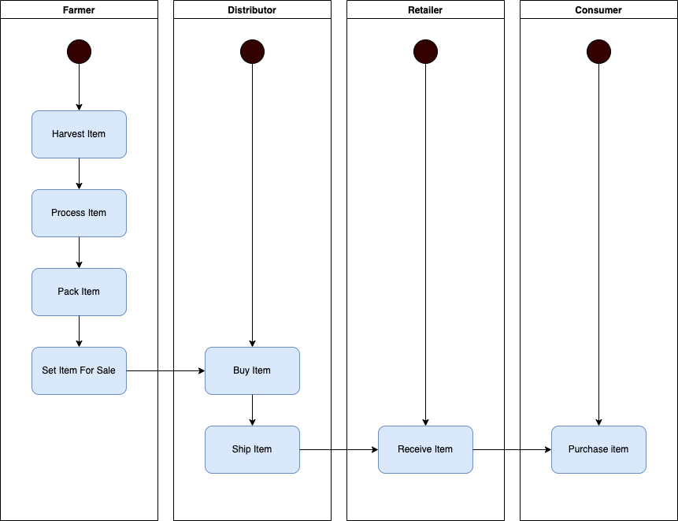

# Supply chain & data auditing

This repository containts an Ethereum DApp that demonstrates a Supply Chain flow between a Seller and Buyer. The user story is similar to any commonly used supply chain process. A Seller can add items to the inventory system stored in the blockchain. A Buyer can purchase such items from the inventory system. Additionally a Seller can mark an item as Shipped, and similarly a Buyer can mark an item as Received.

## Introduction

This DApp was designed to support the following activity flow:

There are four main actors plus the owner of the contract, which is shown as Manager. I've decided to include it since the contract, therefore the DApp, has access control checks for each one of the actors. These access controls must be set by the owner or manager of the contract, which, for convenience, has its own section in the UI to register new actors.

Each actor has its own dedicated section in the DApp which can only be accessed by users with the appropriate role. The DApp requires the user connects their wallet and, once connected, it checks the user roles and opens up the sections they have access to. On each section, the user can find existing items by UPC, run actions based on their role and current item state and check every available detail for the current item.

The whole UI template has been replaced by my own implementation based on Next.js. It is React what I use for web development and I wanted to experiment with Next.js for the first time.

### Personal decisions

One thing that I couldn't get my head around was the proposed contract inheritance. SupplyChain is the main contract that supports DApp functionality. It inherits from a series of role contracts to control access to each action based on the sender's role. In turn, Ownable contract is supposed to inherit from SupplyChain but it's never used and, on top of that, it's a simple contract of the same nature as role contracts, only this one controls access to owner/manager. I switched the inheritance path and I made SupplyChain inherit from Ownable too and I replaced all basic owner checks from SupplyChain with the ones from Ownable.

### Technologies used

- _Typescript_: although more complicated than vanilla JS, I think investing in learning Typescript pays off since most serious projects favour Typescript over Javascript, plus with IDE aids it makes for a nice developer experience and safer code.

- _Next.js_: I decided to try Next.js since it was the perfect time to try this framework for the first time. I took React Developer Udacity nanodegree before this and I wanted this project to be a refresher plus something new. I liked the experience and it will be my starting point for every React app from now on.

- _Chakra UI_: it's a rich, easy-to-use React UI component library I use for the second time. It is perhaps easier and leaner than MUI but a bit more limited from what I see. More than enough for the needs of this project and very popular among Web3 developers from what I see from examples in the Internet.

- _Wagmi_: it's a React hooks library for Web3. Useful and powerful for React with Typescript development but I'd say not the most popular around for the lack of examples or discussions. I had sequencing issues with UsePrepareContractWrite and UseContractWrite. They're not supposed to run one after the other isolatedly from what I gather. The prepare hook is updated by user input and the write hook is triggered by another action. My main problem is I find problematic prepare hook gets updated with non-validated data from preliminary user input and throws errors because of that. It looks to be the case even when disabled if the input data type is wrong. When arguments are required, in order to avoid preparing the contract with incomplete data, I enable the prepare hook from the submit action and I trigger a deferred write action for the associated hook. Ugly but it works. I look forward to a more elegant way of doing it.

- _Connect Kit_: nice and simple wallet implementation that plays nicely with wagmi. I tried RainbowKit, it works great too, but this one is perhaps nicer.

- _sol2uml_: why would I type all my contracts definitions in a UML Classes diagram when a good samarithan already created a tool for that?

### Deployments

- _Goerli_:
  - Address: 0x1d7e7B822b8492fe3E83394DD68106B05773b184
  - Owner: 0xf5FCD93a14025E8280f8C890056f6Eb928D9bC09
  - Transaction ID: 0xdd24175fa0a66995117dd06fa6a48a6d4f4636e212c3f93293bf4c16ec31b68e

### Authors

- Fernando de los Ríos Sánchez

### Versions

- Truffle v5.6.4 (core: 5.6.4)
- Ganache v7.5.0
- Solidity - 0.8.17 (solc-js)
- Node v16.18.1
- Web3.js v1.7.4

### Acknowledgments

- Solidity
- Ganache-cli
- Truffle
- Next.js
- Chakra UI
- Wagmi
- ConnectKit
- sol2uml
